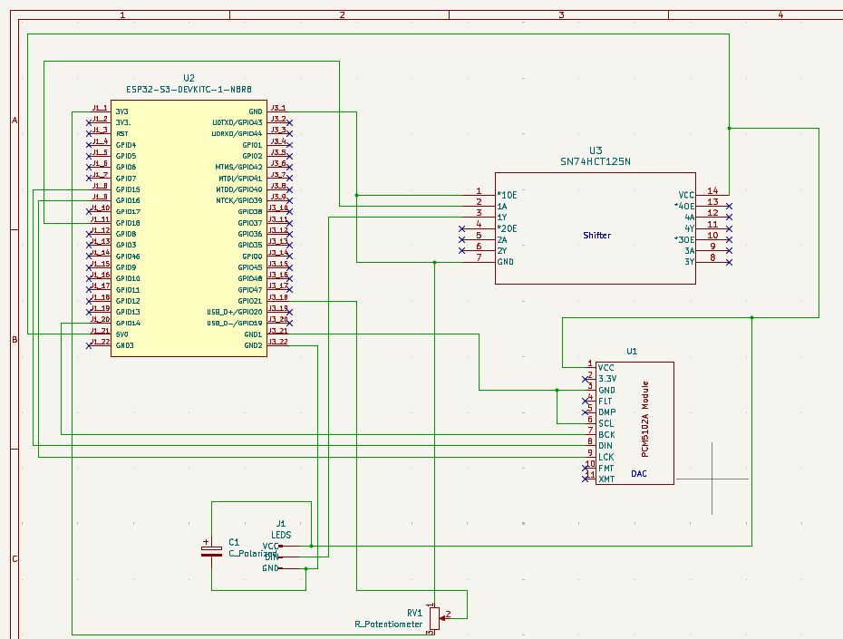
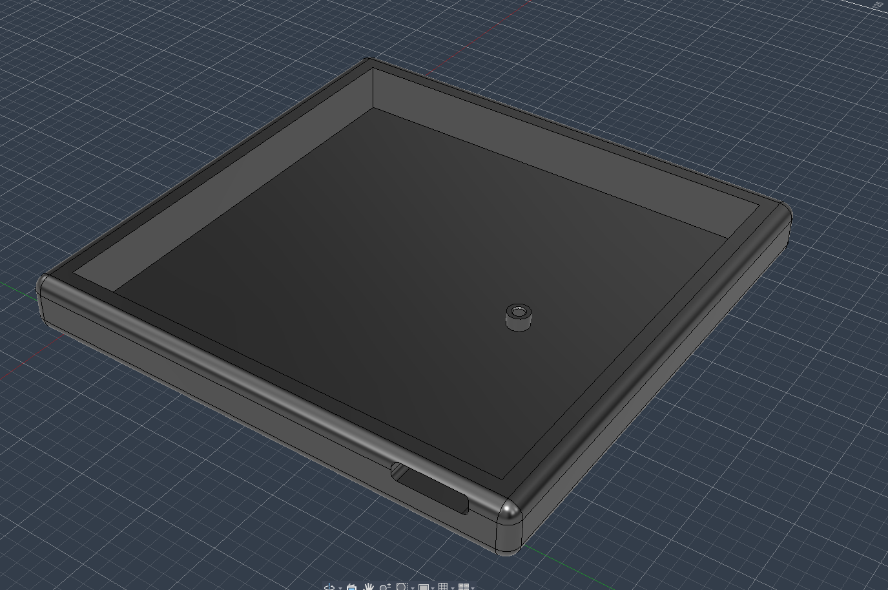

# ESP-View
This is a music visualiser + DAC that does exactly that - it plays the music through USB, and visualises it.
Also, a better name will be much appreciated :)
# PCB
The PCB is designed in kicad.

# Case
The case features a screw and a little groove where the PCB slides.
It has a slick, modern, round design.

Designed in Fusion 360.

# The brain
The whole thing is powered by a ESP32, paired with a PCM5102A DAC.
