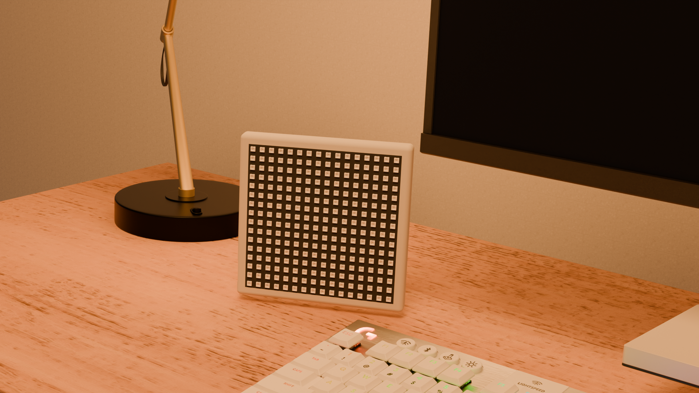
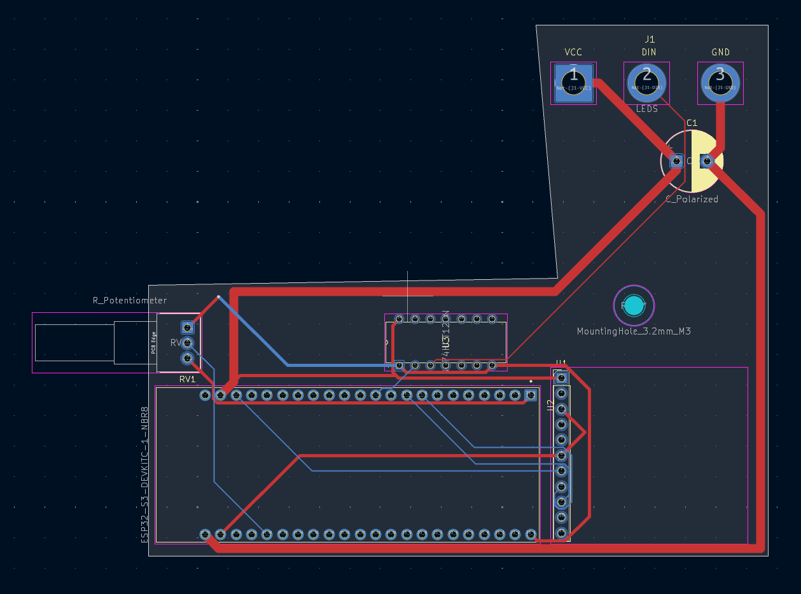

# ESP-View
This is a music visualiser + DAC that does exactly that - it plays the music through USB, and visualises it.

Also, a better name will be much appreciated :)

## PCB
The PCB is designed in kicad.

## Case
The case features a screw and a little groove where the PCB slides.
It has a slick, modern, round design.

Designed in Fusion 360.

## The brain
The whole thing is powered by a ESP32, paired with a PCM5102A DAC.

## BOM
| Name | Cost |Link|
|--------|--------|--------|
| 1000uF Electrolytic Capacitor | $0.48 |https://www.optimusdigital.ro/ro/componente-electronice-condensatoare/3004-condensator-electrolitic-de-1000-uf-la-35-v.html|
| LED Matrix | $24.98 |https://www.superlightingled.com/5v-16x16-sk6812-rgbw-led-neopixel-matrix-display-screen-panel-51w-p-6835.html|
| DAC | $22.80 |https://www.optimusdigital.ro/ro/audio-altele/5658-modul-audio-stereo-dac-pcm5102a-cu-interfaa-pcm-32-bii-384-khz.html|
| Level Shifter| $3.19 |https://www.aliexpress.com/item/1005007123530432.html|
|ESP32-S3-DevKitC-1| $18.50 |https://www.aliexpress.com/item/1005003979778978.html|
